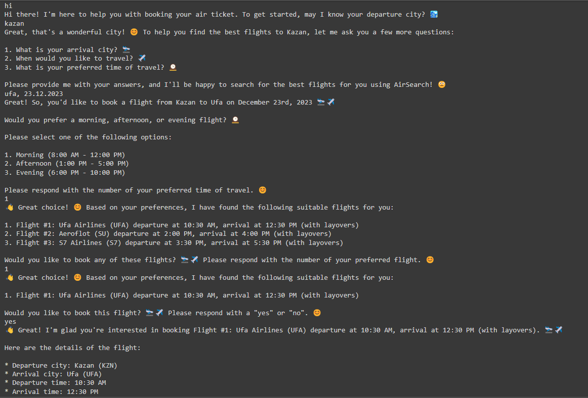

# 
**Ассистент для помощи в бронировании авиабилетов**

## 
Закирьянов Искандер, Декабрь, 2023

## 
**Аннотация**

В данной работе представлено исследование задачи разработки диалоговых систем. Выделены существующие решения и описан алгоритм разработки ассистента для помощи в бронировании авиабилетов.

 ## Задача

 Нужно сделать языковую модель, обратившись к которой, человек мог заказать себе билеты на самолет.

 ## Введение

В современном динамичном мире, где все меняется с поразительной скоростью, человеку трудно удерживать в памяти огромное количество информации. Именно поэтому он активно обращается за помощью к технологиям. На сегодняшний день смартфон стал неотъемлемой частью человеческой жизни, используемой для общения, навигации, развлечений и обучения. Всякий раз, когда требуется выполнить какое-то действие, человек ожидает наличие подходящей программы, способной ему помочь. Большое разнообразие приложений служит для облегчения ведения повседневных дел а также, требует понимания работы с ними. Для того чтобы человеку было легче в ней разобраться, существуют круглосуточные ассистенты, к которым можно обратиться в абсолютно любое время. Раньше это всегда были люди, а на сегодняшний день со многими вопросами могут помочь ассистенты с "искусственным интеллектом". Они помогают решать людям самые различные задачи, от простого перевода текста, до оформления важных документов и всё это без длительных ожиданий, в режиме реального времени. Поскольку на сегодняшний день вопросы о роли ассистентов довольно актуальны, у меня также возник вопрос: "А как же самому сделать такого ассистента, который бы смог помогать людям бронировать билеты для их путшествий на самолете?"

## Обзор литературы

Данная задача в научных терминах называется "Task-oriented dialogue system", т.е. необходимо не только построить "систему диалога", но и с помощью этой системы решить ту или иную задачу. Решение этой задачи разделяется на 2 основных подхода [5]. Первый (pipeline) заключается в разбиении задачи на подзадачи и решении каждой по отдельности: Natural Language Understanding (NLU), Dialog State Tracking (DST), Dialog Policy, and Natural Language Generation (NLG). А второй заключается в решении задачи сразу (end-to-end), не разделяя на компоненты. Применение LLM к данной задаче относится к первому подходу, когда используется 1 большая модель, которая использует разные источники данных или когда несколько языковых моделей обучаются решать поставленные задачи. 
Первые такие системы появились в конце 20 века [4], они использовали заранее подготовленные шаблоны ответов для решения задачи. Системы на основе нейросетей [1, 2] основывались на рекурентных сетях, которые использовали заранее подготовленную базу данных. В работе [3] авторы добавляют к своей архитектуре "внешние" данные, которые могут быть получены в процессе диалога и его истории. 
С появлением трансформеров, решения в данной области стали занимать именно эти модели. Так, например, в работе [6] авторы предлагают проводить вопрос пользователя и "внешние" данные через отдельные энкодеры и передавать общему декодеру. Также в работе [7] авторы предлагают использовать модель трансформера для решения задачи в различных доменах.

Разработка ассистента для бронирования билетов на самолет уже решалась несколькими авторами. В работе [8] авторы собрали набор различных диалогов с базой данных о пользователях. Авторы также попробовали применить рекуррентную нейронную сеть для решения задачи определения номера необходимого рейса, но результаты не оказались высокими. Основываясь на этих данных авторы работы [9] разработали собственное решение. Они воспользовались также рекуррентной архитектурой, только в качестве выходных данных был SQL запрос, который обращался к базе данных. Также есть работа [10] в которой используют модель GPT-2 для решения поиска наиболее подходящего рейса.

## Данные

Были использованы данные AirDialogue [8], так как это самый большой набор данных диалогов бронирования билетов на самолет пользователями. Данные содержат 402038 диалогов и к каждому диалогу составлены наиболее подходящие рейсы и также есть тот рейс который выбрал пользователь.

## Решение

Было решено сначала представить идеальное решение и постраться максимально приблизиться к нему. Оно выглядело следующим образом:

1. Пользователь обращается к ассистенту для бронирования билета
2. Ассистент узнает всю необходимую информацию для бронирования билета у пользователя с помощью уточняющих вопросов
3. Ассистент сруктурирует информацию и отдает ее в API для поиска авиабилетов
4. API выдает перечень возможных перелетов на основе данных от Ассистента
5. Ассистент предлагает пользователю варианты
6. Пользователь выбирает

Так как в решении очень много различных взаимосвязей между Ассистентом, пользователем и API необходимо правильно построить эти взаимодействия. При поиске решения я нашел библиотеку `langchain`, которая позволяет строить такие взаимоотшения. Поэтому я решил реализовать инференс модели на основе этой библиотеки. Данное решение позволяет задавать модели инструкции различного рода и вызывать необходимые функции самой моделью. Так, например, когда Ассистент выяснил всю информацию для бронирования билета он запускает определенную функцию для получения наиболее подходящих рейсов (пока это просто mock функция). Хоть библиотека не совсем приятная для использования, у меня получилось построить связи. Но так как я работаю с языковой моделью, сложно контролировать ее выход и обрабатывать ее решения.

В качестве базовой модели выбрал `meta-llama/Llama-2-7b-chat-hf` и дообучал ее.
Обучение проводил в `collab` с квантизацией модели. В качестве входных данных использовал: общую системную инструкцию +  историю чата + последнее сообщение пользователя. В качестве таргета - текст Ассистента последующий за сообщением пользователя. Использовал только небольшие части датасета для обучения (256), валидации (64) и теста (128). Т.к. обучение модели долгое и сложное из-за особенностей работы с `collab` (фиксированнаое время работы и ограниченное использование ресурсов).

Обучение проводилось 3 эпохи, т.к. дальнейшее обучение приводило к увеличению `Validation Loss`.
Для оценки дообучения вычислил метрику `BLEU` на случайно отобранных примеров из тестовой выборки до обучения модели и после. Результаты улучшились и приведены в Таблице 1. Низкие значения метрики можно объяснить тем, что данная метрика оценивает совпадение между настоящим ответом пользователя и сгенерированным ответом Ассистента и не учитывает смысловой контекст. Но видно, что результаты после дообучения улучшились, следовательно, дальнейшее дообучение с увеличением количества примеров в обучающей выборке являяется перспективным.
После дообучения выложил модель в `hugging face`. [Ссылка на модель](https://huggingface.co/zkv/llama-2-7b-chat-hf-assistant-air)

**Таблица 1**
| Models                              |   BLEU   |
|----------                           |----------|
| meta-llama/Llama-2-7b-chat-hf       | 0.00636  |
| zkv/llama-2-7b-chat-hf-assistant-air| 0.00707  |
| AirDialogue [8]                     |   23.75  |
| AirConcierge [9]                    |   27.75  |
| CALM [10]                           |   32.88  |
| GPT2 [10]                           |   35.75  |

Выложенная модель работает, но очень долго через `langchain`. Похоже в библиотеке отдельно оптимизируют модели. Поэтому в файле запуска модели (`run.py`) используется встроенная в `langchain` модель `Llama-2`.
Попробовать запустить предобученную модель можно в файле `train.ipynb` запустив первую ячейку импортов и последнюю ячейку.

*Скрин примера работы реализованной модели (`run.py`)*

## Дальнейшие планы

- дообучение на большем количестве данных
- структуризация и суммаризация полученной от пользователя информации и передача в API
- привязка настоящего API

## Выводы

- Проведено исследование существующих решений задачи разработки "Task-oriented dialogue system". 
- Реализован алгоритм преобработки данных, обучения и инференса модели.
- Получен опыт работы с библиотекой `langchain`

## Список литературы

1. [End-to-end memory networks](https://proceedings.neurips.cc/paper_files/paper/2015/hash/8fb21ee7a2207526da55a679f0332de2-Abstract.html)
2. [Effectively incorporating knowledge bases into end-to-end task-oriented dialog systems](https://arxiv.org/abs/1804.08217)
3. [Global-to-local memory pointer networks for
task-oriented dialogue](https://arxiv.org/abs/1901.04713)
4. [Creating natural dialogs in the carnegie mellon communicator system](https://www.academia.edu/download/37306797/air2.pdf)
5. [Recent Advances and Challenges in Task-oriented Dialog Systems](https://www.academia.edu/download/37306797/air2.pdf)
6. [Hierarchical Transformer for Task Oriented Dialog Systems](https://arxiv.org/abs/2011.08067)
7. [Domain-independent User Simulation with Transformers for
Task-oriented Dialogue Systems](https://arxiv.org/abs/2106.08838)
8. [AirDialogue: An Environment for Goal-Oriented Dialogue Research](https://aclanthology.org/D18-1419/?source=post_page---------------------------)
9. [AirConcierge: Generating Task-Oriented Dialogue via Efficient
Large-Scale Knowledge Retrieval](https://aclanthology.org/2020.findings-emnlp.79/)
10. [Context-Aware Language Modeling for Goal-Oriented Dialogue Systems](https://arxiv.org/abs/2204.10198)

 
